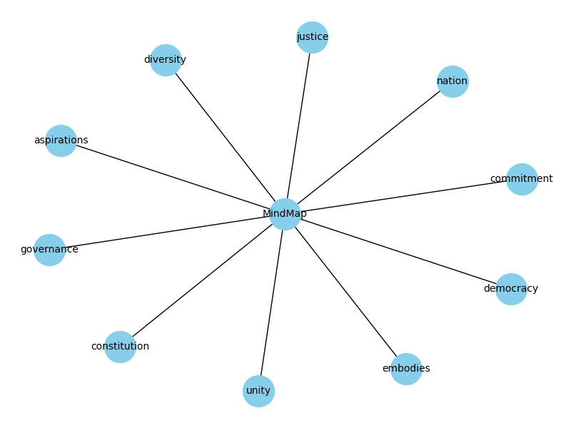

# Mind-Map

# MindMap Generator

The MindMap Generator is a web application built using Flask, designed to extract keywords from user-input text and visualize them in a network graph, providing an intuitive representation of the central concepts within the text. Mind maps serve as powerful visual tools that aid in organizing thoughts, concepts, and information in a non-linear and intuitive manner. 
This is a feature updation of the projet that I am trying to build, which will help students learn anything much effectively than the conventional way of teaching : https://x.com/13_cs2/status/1692441104199594490?s=20

## Features

### Extract Keywords

- The application extracts keywords from the provided text using NLTK and BERT-based NER (Named Entity Recognition) from the Hugging Face Transformers library.

### Network Graph Generation

- Generates a network graph using NetworkX and Matplotlib to visualize the extracted keywords.
- Links the keywords to a root node labeled "MindMap" to represent the central concept.

## Libraries Used

- [Hugging Face Transformers](https://huggingface.co/transformers/): Utilized for BERT-based Named Entity Recognition (NER) to extract keywords.
- [Flask](https://flask.palletsprojects.com/en/2.0.x/): A web framework for Python used to build the application.
- [NLTK (Natural Language Toolkit)](https://www.nltk.org/): Used for tokenization, part-of-speech tagging, and stopword removal in text processing.
- [NetworkX](https://networkx.org/): Library for the creation, manipulation, and study of complex networks.
- [Matplotlib](https://matplotlib.org/): A plotting library used for generating the network graph visualization.

## Generated Mind-Maps




## Usage

1. Clone this repository

```bash
  git clone https://github.com/Namitha-S-11465/Mind-Map.git
```

2. Install the requirements

```bash
    pip install -r requirements.txt
```
    
3. Run the file

```bash
    python app.py
```

4. Copy paste the text in the textbox

5. On clicking Submit, a map will be generated and sutomatically saved inside the static directory.
